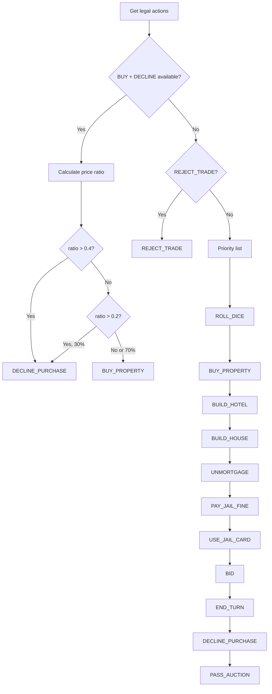

## GreedyAgent

Strategic AI that prioritizes buying properties and building houses/hotels.

### Characteristics

| Aspect | Behavior |
|--------|----------|
| **Strategy** | Maximize property ownership and development |
| **Determinism** | Deterministic (seeded by player_id) |
| **Property buying** | Buy if < 40% of cash, sometimes decline 20‑40% |
| **Building** | Prioritize hotels > houses |
| **Auctions** | Conservative bidding (max 50% of cash) |
| **Trading** | Rejects all incoming trades |

### Decision Logic



### Usage

```python
from agents import GreedyAgent
from monopoly.rules import get_legal_actions, apply_action

agent = GreedyAgent(player_id=0, name="Alice")

# During game loop
legal = get_legal_actions(game, 0)
action = agent.choose_action(game, legal)
apply_action(game, action)
```

### Property Purchase Strategy

The agent evaluates purchases based on cash reserves:

```python
price_ratio = property_price / player_cash

if price_ratio > 0.4:
    # Too expensive, decline to trigger auction
    return DECLINE_PURCHASE

if price_ratio > 0.2:
    # Moderately expensive, 30% chance to decline
    if random() < 0.3:
        return DECLINE_PURCHASE

# Affordable, buy it
return BUY_PROPERTY
```

This creates auction opportunities while maintaining cash reserves.

### Action Priority

When no special conditions apply, actions are chosen by priority:

| Priority | Action | Rationale |
|----------|--------|-----------|
| 1 | ROLL_DICE | Keep game moving |
| 2 | BUY_PROPERTY | Acquire assets |
| 3 | BUILD_HOTEL | Maximize rent income |
| 4 | BUILD_HOUSE | Increase property value |
| 5 | UNMORTGAGE_PROPERTY | Restore income |
| 6 | PAY_JAIL_FINE | Get out of jail |
| 7 | USE_JAIL_CARD | Alternative jail exit |
| 8 | BID | Participate in auctions |
| 9 | END_TURN | Complete turn |
| 10 | DECLINE_PURCHASE | Fallback |
| 11 | PASS_AUCTION | Last resort |

### Auction Bidding

Conservative bidding strategy:

```python
current_bid = game.active_auction.current_bid
max_bid = player_cash // 2  # Never bid more than 50% of cash

if current_bid + 10 <= max_bid:
    return BID(amount=current_bid + 10)
else:
    # Skip to next action in priority
    continue
```

### Determinism

The agent uses a seeded RNG for reproducibility:

```python
self.rng = random.Random(player_id)
```

Same player_id + same game state = same decisions.

### Use Cases

- **Competitive play**: Reasonable opponent for testing
- **Benchmarking**: Compare advanced agents against greedy baseline
- **Demonstrations**: Show strategic gameplay
- **Training data**: Generate games for ML models

### Limitations

- No long‑term planning
- No monopoly completion strategy
- No opponent cash tracking
- Ignores trading opportunities
- Fixed bidding increment (+10)

### Reference

::: agents.greedy.GreedyAgent
