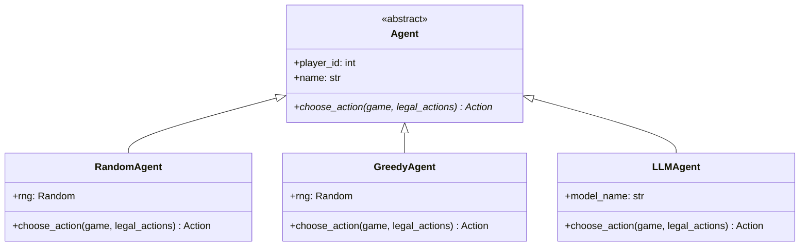
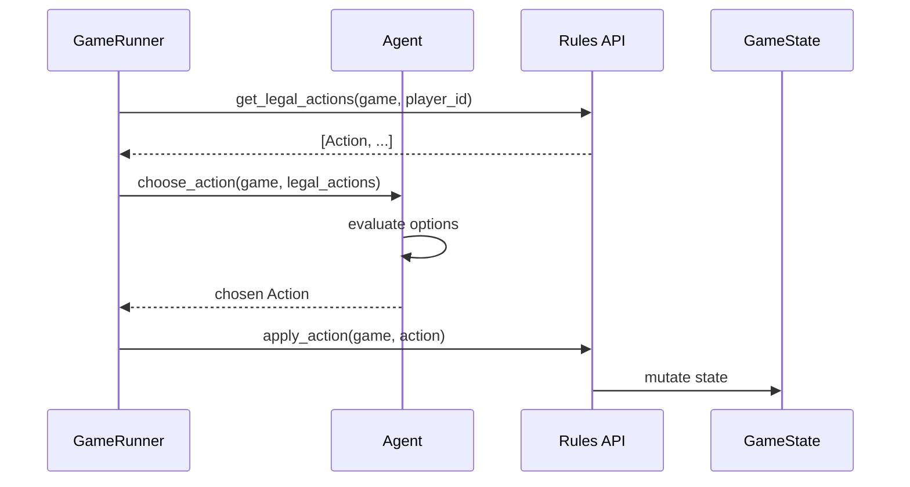

## Agents Architecture

Agents are AI players that automatically make decisions during Monopoly games. All agents inherit from the abstract `Agent` base class and implement the `choose_action()` method.

### Available Agents

| Agent | Description | Use Case |
|-------|-------------|----------|
| `RandomAgent` | Makes random legal moves | Testing, baseline comparison |
| `GreedyAgent` | Prefers buying and building | Simple competitive play |
| `LLMAgent` | LLM‑powered decisions | Advanced AI research (stub) |

### Agent Hierarchy



### Decision Flow



### Usage

```python
from agents import RandomAgent, GreedyAgent, LLMAgent
from monopoly.rules import get_legal_actions, apply_action

# Create agents for each player
agents = [
    GreedyAgent(0, "Alice"),
    RandomAgent(1, "Bob"),
    GreedyAgent(2, "Charlie"),
]

# Game loop
while not game.game_over:
    current = game.get_current_player()
    legal_actions = get_legal_actions(game, current.player_id)

    if legal_actions:
        agent = agents[current.player_id]
        action = agent.choose_action(game, legal_actions)
        apply_action(game, action)
```

### Creating Custom Agents

Extend the `Agent` base class and implement `choose_action()`:

```python
from agents import Agent
from monopoly.rules import Action

class MyCustomAgent(Agent):
    def __init__(self, player_id: int, name: str):
        super().__init__(player_id, name)
        # Custom initialization

    def choose_action(self, game, legal_actions: list[Action]) -> Action:
        # Your decision logic here
        return legal_actions[0]
```

### Agent Comparison

| Feature | RandomAgent | GreedyAgent | LLMAgent |
|---------|-------------|-------------|----------|
| Deterministic | No | Yes (seeded) | No |
| Property buying | Random | Strategic | Context‑aware |
| Building | Random | Prioritized | Reasoned |
| Auctions | Random bids | Conservative | Adaptive |
| Trading | Rejects all | Rejects all | Future |
| Complexity | O(1) | O(n) | O(API call) |

### Integration with Server

The `GameRunner` uses agents based on player roles:

```python
# In server/runner.py
for i, role in enumerate(roles):
    if role == "human":
        self.agents[i] = None  # Wait for REST API
    elif role == "random":
        self.agents[i] = RandomAgent(i, names[i])
    elif role == "greedy":
        self.agents[i] = GreedyAgent(i, names[i])
    elif role == "llm":
        self.agents[i] = LLMAgent(i, names[i])
```
