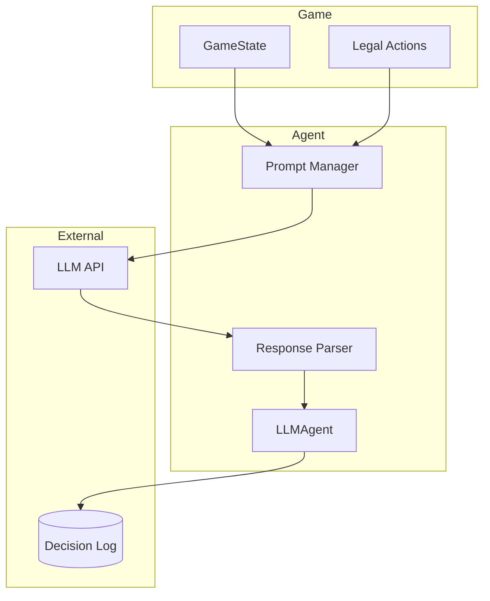

## LLMAgent

LLM‑powered agent that uses language models to make strategic decisions.

> **Note:** This is currently a stub implementation. The actual LLM integration will be implemented in a future version.

### Planned Characteristics

| Aspect | Planned Behavior |
|--------|------------------|
| **Strategy** | Context‑aware reasoning |
| **Determinism** | Non‑deterministic (LLM sampling) |
| **Property buying** | Value‑based evaluation |
| **Building** | Strategic timing |
| **Auctions** | Adaptive bidding |
| **Trading** | Active negotiation |

### Current Status

```python
from agents import LLMAgent

agent = LLMAgent(player_id=0, name="Alice", model_name="gpt-4")

# Currently raises NotImplementedError
action = agent.choose_action(game, legal_actions)
# NotImplementedError: LLMAgent is not yet implemented.
```

### Planned Architecture



### Planned Interface

```python
class LLMAgent(Agent):
    def __init__(
        self,
        player_id: int,
        name: str,
        model_name: str = "gpt-4",
        temperature: float = 0.7,
        strategy_prompt: str | None = None,
    ):
        super().__init__(player_id, name)
        self.model_name = model_name
        self.temperature = temperature
        self.strategy_prompt = strategy_prompt

    def choose_action(self, game, legal_actions) -> Action:
        # 1. Build prompt with game state
        # 2. Query LLM
        # 3. Parse response to Action
        # 4. Log decision for analysis
        raise NotImplementedError()
```

### Database Integration

LLM decisions will be logged to `llm_decisions` table:

| Field | Purpose |
|-------|---------|
| `game_state` | Full game snapshot at decision time |
| `player_state` | Agent's cash, properties, position |
| `available_actions` | Legal actions presented |
| `prompt` | Full prompt sent to LLM |
| `reasoning` | LLM's step‑by‑step reasoning |
| `chosen_action` | Final action selected |
| `processing_time_ms` | Decision latency |

### Planned Features

1. **Context Window Management**
   - Summarize game history
   - Include recent events
   - Track opponent behavior

2. **Strategy Profiles**
   - Aggressive (high risk, property accumulation)
   - Conservative (cash preservation)
   - Balanced (adaptive)

3. **Reasoning Chain**
   - Explicit step‑by‑step thinking
   - Action justification
   - Risk assessment

4. **Learning**
   - Accumulate experience in `llm_learning_data`
   - Adjust strategy based on outcomes
   - Cross‑game pattern recognition

### Example Prompt Structure (Planned)

```
You are playing Monopoly as {name}. Your goal is to win by bankrupting opponents.

## Current State
- Turn: {turn_number}
- Your cash: ${cash}
- Your properties: {properties}
- Your position: {space_name}

## Other Players
{opponent_summaries}

## Recent Events
{recent_events}

## Available Actions
{formatted_actions}

## Your Strategy
{strategy_prompt}

Choose the best action and explain your reasoning.
```

### Contributing

To implement LLMAgent:

1. Add LLM client (OpenAI, Anthropic, etc.)
2. Implement prompt building in `_build_prompt()`
3. Implement response parsing in `_parse_response()`
4. Add decision logging via `GameRepository.add_llm_decision()`
5. Add tests for edge cases

### Reference

::: agents.llm.LLMAgent
