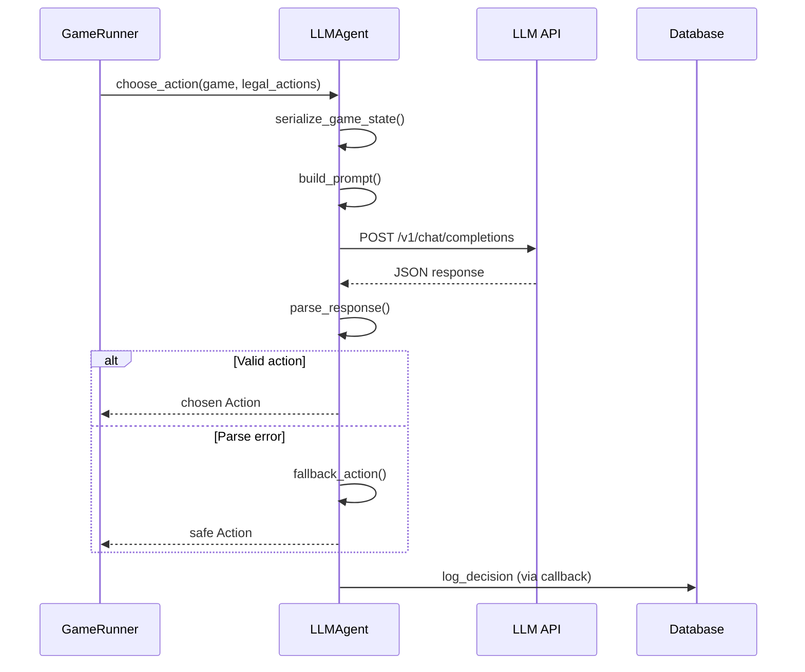

## LLMAgent

LLM-powered agent that uses language models via OpenAI-compatible API to make strategic decisions in Monopoly.

### Overview

LLMAgent communicates with LLM backends (vLLM, Ollama, or any OpenAI-compatible API) to make intelligent game decisions. It:

1. Serializes the current game state into a compact JSON format
2. Constructs a prompt with system instructions, strategy profile, and legal actions
3. Queries the LLM via OpenAI-compatible API (`/v1/chat/completions`)
4. Parses the JSON response and validates the action
5. Falls back to a safe action if parsing/validation fails
6. Optionally logs decisions to the database for analysis

### Supported Backends

| Backend | Default Port | Base URL |
|---------|--------------|----------|
| **Ollama** | 11434 | `http://localhost:11434/v1` |
| **vLLM** | 8000 | `http://localhost:8000/v1` |
| **OpenAI** | - | `https://api.openai.com/v1` |

### Configuration

LLMAgent can be configured via environment variables or constructor parameters:

#### Environment Variables

```bash
# Base URL for OpenAI-compatible API
LLM_BASE_URL=http://localhost:11434/v1  # Ollama (default)
# LLM_BASE_URL=http://localhost:8000/v1  # vLLM

# Model name (varies by backend)
LLM_MODEL=gemma3:4b                      # Ollama
# LLM_MODEL=google/gemma-3-4b-it         # vLLM

# Optional: timeout and token limits
LLM_TIMEOUT=30.0
LLM_MAX_TOKENS=512
```

#### Constructor Parameters

```python
from agents import LLMAgent

agent = LLMAgent(
    player_id=0,
    name="Alice",
    model_name="gemma3:4b",        # Optional, uses LLM_MODEL env var
    strategy="balanced",            # aggressive, balanced, defensive
    base_url="http://localhost:11434/v1",  # Optional, uses LLM_BASE_URL env var
    decision_callback=my_callback,  # Optional, for logging decisions
)
```

### Strategy Profiles

LLMAgent supports three built-in strategy profiles that influence decision-making:

| Strategy | Cash Reserve | Property Buying | Auction Behavior | Building |
|----------|--------------|-----------------|------------------|----------|
| **aggressive** | Minimal | Buy everything | Bid high, outbid opponents | Build fast, leverage monopolies |
| **balanced** | $200+ | Strategic purchases | Reasonable bids | Steady development |
| **defensive** | $400+ | Conservative | Low bids, often pass | Careful building |

Strategy templates are stored in `templates/`:
- `templates/system_prompt.txt` - Base instructions
- `templates/aggressive.txt` - Aggressive strategy
- `templates/balanced.txt` - Balanced strategy
- `templates/defensive.txt` - Defensive strategy

### Decision Flow



### Usage Examples

#### Basic Usage

```python
from agents import LLMAgent
from monopoly.rules import get_legal_actions, apply_action

# Create agent with default settings (uses env vars)
agent = LLMAgent(player_id=0, name="Alice")

# In game loop
legal_actions = get_legal_actions(game, 0)
action = agent.choose_action(game, legal_actions)
apply_action(game, action)
```

#### With Custom Strategy

```python
agent = LLMAgent(
    player_id=0,
    name="Aggressive AI",
    strategy="aggressive",  # Buy everything, bid high
)
```

#### With Decision Logging

```python
def log_decision(decision_data: dict):
    """
    decision_data contains:
    - player_id: int
    - turn_number: int
    - sequence_number: int (per-player decision count)
    - game_state: dict (game state snapshot)
    - player_state: dict (player's state)
    - available_actions: dict (legal actions)
    - prompt: str (full prompt sent to LLM)
    - raw_response: str (LLM's raw response)
    - reasoning: str (extracted reasoning)
    - chosen_action: dict (action_type and params)
    - used_fallback: bool (whether fallback was used)
    - error: str|None (error message if any)
    - processing_time_ms: int (decision latency)
    - model_version: str (model name)
    - strategy: str (strategy profile used)
    """
    print(f"Turn {decision_data['turn_number']}: {decision_data['chosen_action']}")
    print(f"Reasoning: {decision_data['reasoning']}")

agent = LLMAgent(
    player_id=0,
    name="Alice",
    decision_callback=log_decision,
)
```

#### Batch Games Integration

The batch games script automatically sets up decision callbacks for database logging:

```bash
# Run batch games with LLM agents - decisions are logged to database
uv run python scripts/batch_games.py -n 5 -p 4 -a llm -s balanced

# Run with mixed agents
uv run python scripts/batch_games.py -n 5 --roles llm,greedy,greedy,random
```

Each LLM player maintains their own `sequence_number` counter (1, 2, 3, ...) for their decisions within a game. The database unique constraint is on `(game_uuid, player_id, sequence_number)`, allowing multiple LLM players in the same game.

### Prompt Structure

The agent builds prompts with the following structure:

```
[System Prompt - from templates/system_prompt.txt]
- JSON response format requirements
- Monopoly rules reminder
- Decision criteria

[Strategy Profile - from templates/{strategy}.txt]
- Strategy-specific instructions
- Priority guidelines

[Game State]
- Turn number, phase
- Active auction details (if any)
- Pending payments

[Player State]
- Cash, position, jail status
- Owned properties with details
- Monopolies held

[Available Actions]
- List of legal actions with parameters

Choose action and provide reasoning in JSON format.
```

### Response Format

The LLM must respond with JSON:

```json
{
  "reasoning": "Mediterranean Avenue completes my brown monopoly...",
  "action": {
    "action_type": "BUY_PROPERTY",
    "params": {"position": 1}
  }
}
```

### Fallback Behavior

If the LLM fails to respond or returns invalid JSON, the agent uses safe fallbacks:

1. `END_TURN` - If available, end the turn safely
2. `ROLL_DICE` - If dice roll is pending
3. `PASS_AUCTION` - If in auction
4. First legal action - Last resort

Fallback usage is tracked in `decision_data['used_fallback']`.

### Database Integration

LLM decisions are logged to the `llm_decisions` table when using `GameRunner` or the batch games script:

| Field | Type | Description |
|-------|------|-------------|
| `game_uuid` | UUID | Foreign key to games table |
| `player_id` | Integer | Player who made decision (0, 1, 2, ...) |
| `turn_number` | Integer | Game turn number |
| `sequence_number` | Integer | Per-player decision sequence (1, 2, 3, ...) |
| `timestamp` | DateTime | When decision was made |
| `game_state` | JSONB | Full game state snapshot |
| `player_state` | JSONB | Player's state at decision time |
| `available_actions` | JSONB | Legal actions presented |
| `prompt` | Text | Full prompt sent to LLM |
| `reasoning` | Text | LLM's reasoning (full-text searchable) |
| `chosen_action` | JSONB | Final action selected with params |
| `strategy_description` | Text | Strategy profile used (aggressive/balanced/defensive) |
| `processing_time_ms` | Integer | Decision latency in milliseconds |
| `model_version` | String | Model name used (e.g., "gemma3:4b") |

**Note**: The unique constraint is on `(game_uuid, player_id, sequence_number)`, allowing multiple LLM players to have independent decision sequences within the same game.

#### Querying Decisions

```python
from server.database import session_scope, GameRepository

async with session_scope() as session:
    repo = GameRepository(session)

    # Get all decisions for a game
    decisions = await repo.get_llm_decisions_for_game(game_uuid)

    # Search by reasoning text
    results = await repo.search_llm_reasoning("monopoly strategy")
```

### Performance Considerations

| Aspect | Recommendation |
|--------|----------------|
| **Timeout** | 30 seconds default; increase for slower models |
| **Token limit** | 512 tokens sufficient for decisions |
| **Temperature** | 0.3 for consistency; higher for variety |
| **Batch size** | One request per decision (no batching) |

### Troubleshooting

#### Connection Errors

```
httpx.ConnectError: Connection refused
```

Ensure your LLM backend is running:
- Ollama: `ollama serve`
- vLLM: `python -m vllm.entrypoints.openai.api_server --model <model>`

#### Invalid JSON Responses

If the model frequently returns invalid JSON:
1. Try a larger/more capable model
2. Reduce temperature (0.1-0.3)
3. Check system prompt is clear about JSON format

#### Slow Responses

1. Use a smaller model (e.g., gemma3:4b vs gemma3:27b)
2. Increase timeout: `LLM_TIMEOUT=60`
3. Consider local GPU acceleration

### Reference

::: agents.llm.LLMAgent
