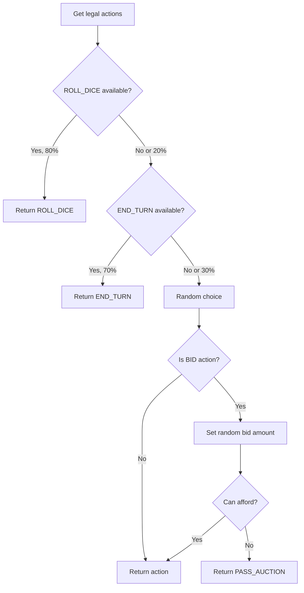

## RandomAgent

Simple AI that makes random legal moves with basic priorities to keep the game flowing.

### Characteristics

| Aspect | Behavior |
|--------|----------|
| **Strategy** | Random selection from legal actions |
| **Determinism** | Non‑deterministic (unseeded RNG) |
| **Property buying** | Random (80% chance to consider other options) |
| **Building** | Random |
| **Auctions** | Random bids between current + 1 and current + 100 |
| **Trading** | No active trading |

### Decision Logic



### Usage

```python
from src.core.agents import RandomAgent
from src.core.game.rules import get_legal_actions, apply_action

agent = RandomAgent(player_id=0, name="Alice")

# During game loop
legal = get_legal_actions(game, 0)
action = agent.choose_action(game, legal)
apply_action(game, action)
```

### Priorities

The agent uses probabilistic priorities to avoid infinite loops:

1. **ROLL_DICE** - 80% chance to select immediately
2. **END_TURN** - 70% chance to select if dice not chosen
3. **Random** - Any remaining legal action

### Auction Bidding

When bidding in auctions:

```python
# Bid between current_bid + 1 and min(player_cash, current_bid + 100)
max_bid = min(player_cash, current_bid + 100)
if max_bid > current_bid:
    bid_amount = random.randint(current_bid + 1, max_bid)
else:
    # Can't afford, pass instead
    return PASS_AUCTION
```

### Use Cases

- **Testing**: Verify game engine handles all action types
- **Baseline**: Compare other agents against random play
- **Stress testing**: Generate diverse game scenarios
- **Simulation**: Monte Carlo analysis of game outcomes

### Limitations

- No strategic planning
- No property valuation
- No opponent modeling
- May make suboptimal moves frequently

### Reference

::: agents.random.RandomAgent
