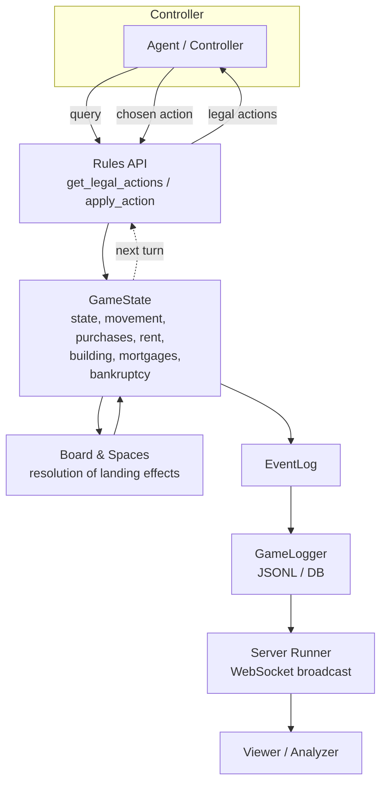
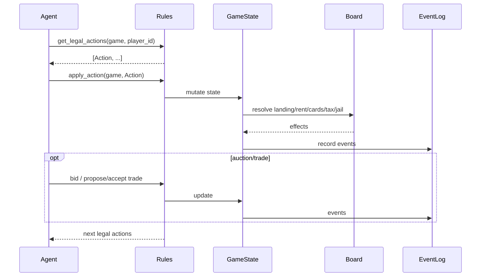

## Monopoly Architecture

This engine separates core responsibilities into small, testable modules:

- Game engine: turn management, movement, purchases, rent, auctions, building, mortgages, bankruptcy
- Rules API: legal action discovery + action execution for agents/controllers
- Board model: spaces and color groups; helpers for railroads/utilities lookup
- Cards & Decks: Chance and Community Chest with deterministic RNG
- Economy & Events: Bank and a structured EventLog
- Trades & Auctions: explicit models and flows for player interactions

Data flow:

1) Controller/agent asks for legal actions via `rules.get_legal_actions(game, player_id)`
2) Controller applies an action with `rules.apply_action(game, action)`
3) Engine mutates `GameState`, logs events in `EventLog`, and resolves space effects

Key modules and classes are linked in the side pages, each with examples.

### High‑level Flow (Diagram)

### Turn Interaction (Sequence)

