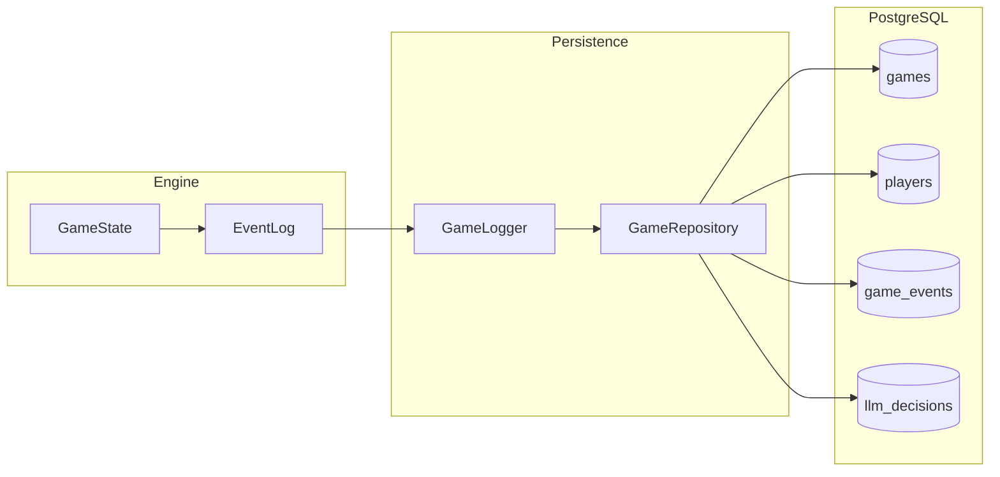
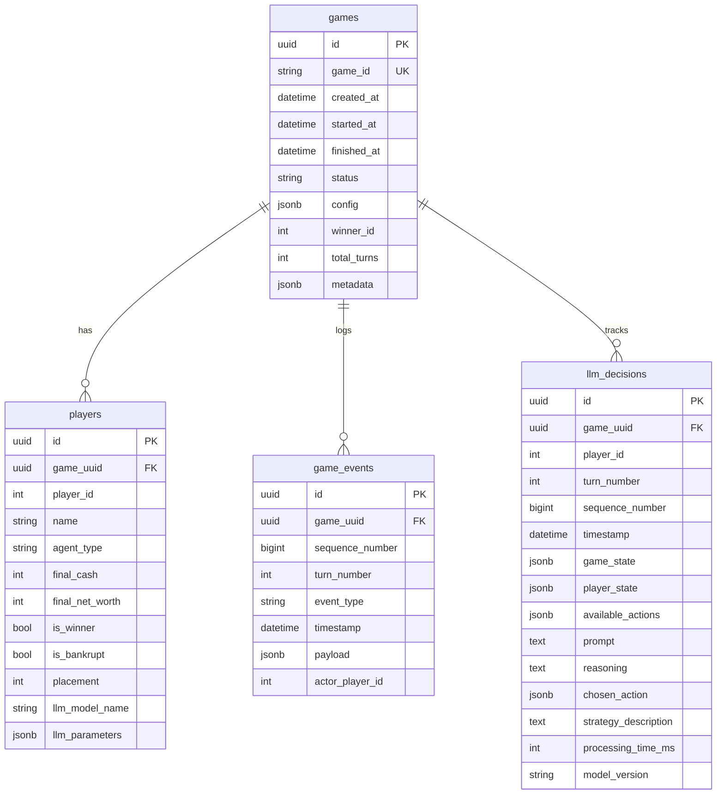

## Database Architecture

PostgreSQL database with SQLAlchemy ORM implementing event sourcing for complete game history.

### Event Sourcing Pattern

All game state changes are recorded as immutable events, enabling:

- Full game replay from event log
- Time‑travel debugging
- Historical analysis and statistics
- Audit trail of all actions



### Schema Overview



### Tables

| Table | Purpose |
|-------|---------|
| `games` | Game session metadata and configuration |
| `players` | Per‑player information and final stats |
| `game_events` | Immutable event log (event sourcing) |
| `llm_decisions` | LLM reasoning and decision context |

### Key Concepts

**Sequence Numbers**: Events have monotonically increasing `sequence_number` (0, 1, 2, ...) ensuring strict ordering and enabling catch‑up queries.

**LLM Decision Sequences**: Each LLM player has their own decision sequence per game. The unique constraint is on `(game_uuid, player_id, sequence_number)`, allowing multiple players to have independent sequences.

**JSONB Payloads**: Event data stored as JSONB for flexibility. Each event type has different payload structure.

**Cascade Deletes**: Deleting a game removes all related players, events, and LLM decisions.

**Connection Pooling**: Async engine with configurable pool size for concurrent access.

### Async Operations

All database operations use async/await:

```python
from data import session_scope, GameRepository

async with session_scope() as session:
    repo = GameRepository(session)
    game = await repo.get_game_by_id("abc123")
    events = await repo.get_game_events(game.id)
```

### Module Reference

| Module | Purpose |
|--------|---------|
| `models.py` | SQLAlchemy ORM models |
| `repository.py` | Database operations (GameRepository) |
| `session.py` | Session and connection management |
| `config.py` | Database configuration from environment |
