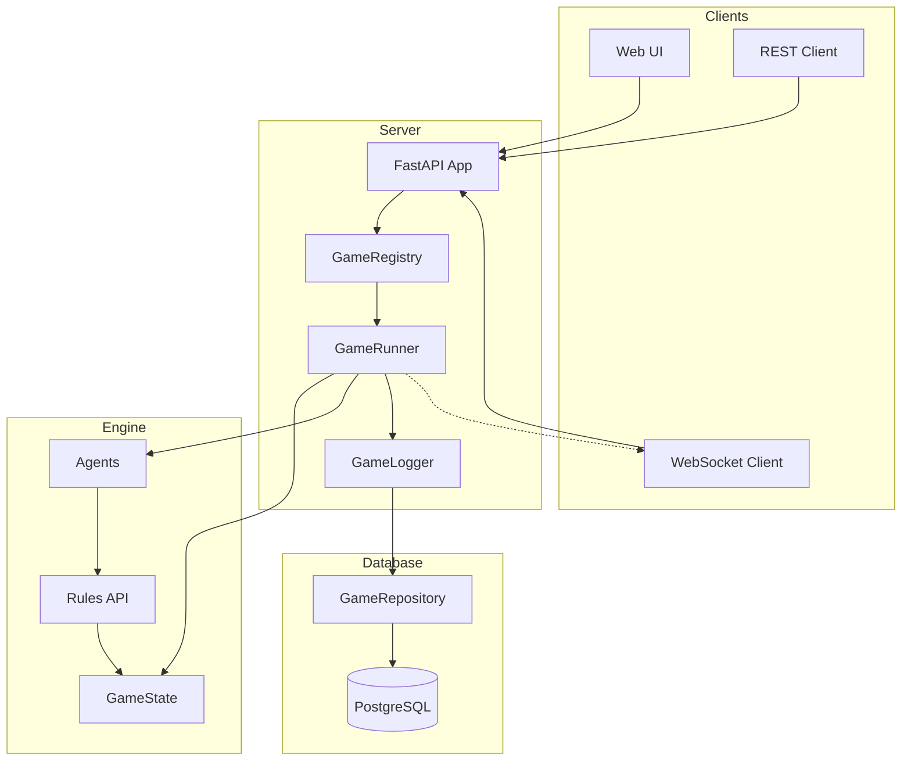
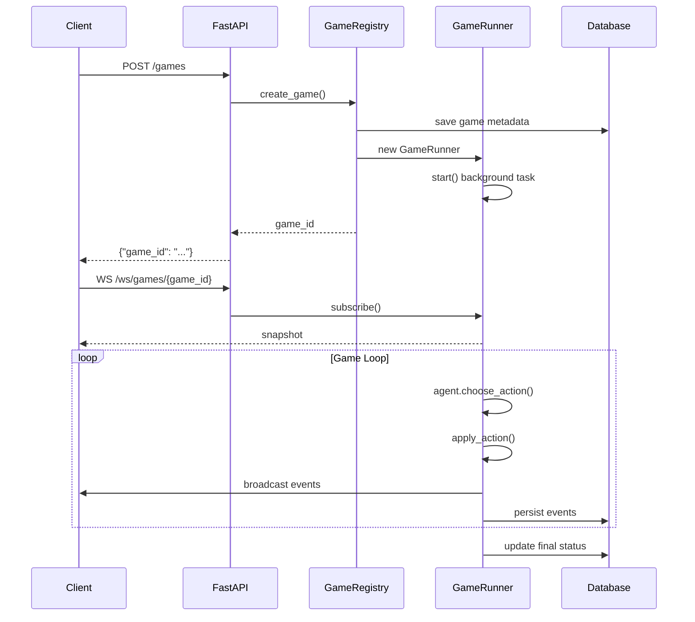

## Server Architecture

The FastAPI server provides REST and WebSocket APIs for managing Monopoly games, enabling real‑time gameplay with AI agents and human players.

- **GameRegistry**: in‑memory management of active game sessions
- **GameRunner**: async game loop driving agents, broadcasting events, handling human input
- **Database layer**: PostgreSQL with event sourcing for full game history
- **WebSocket streaming**: real‑time event delivery to connected clients

### Component Overview

### Request Flow

1. Client creates game via `POST /games`
2. GameRegistry creates GameState and GameRunner
3. GameRunner starts background task driving the game loop
4. Agents act automatically; humans inject actions via REST
5. Events broadcast to WebSocket subscribers
6. Events persisted to database via GameRepository

### Lifecycle (Sequence)

### Key Design Patterns

- **Event Sourcing**: all game state changes logged as immutable events
- **Async Game Loop**: non‑blocking I/O with asyncio for concurrent games
- **Legal Actions Pattern**: clients query valid moves before acting
- **Queue‑Based Broadcasting**: each WebSocket gets dedicated queue

### Module Reference

| Module | Purpose |
|--------|---------|
| `server/app.py` | FastAPI routes and WebSocket endpoints |
| `server/registry.py` | In‑memory game session management |
| `server/runner.py` | Game loop orchestration and event broadcasting |
| `src/data/` | PostgreSQL models, repository, sessions |
