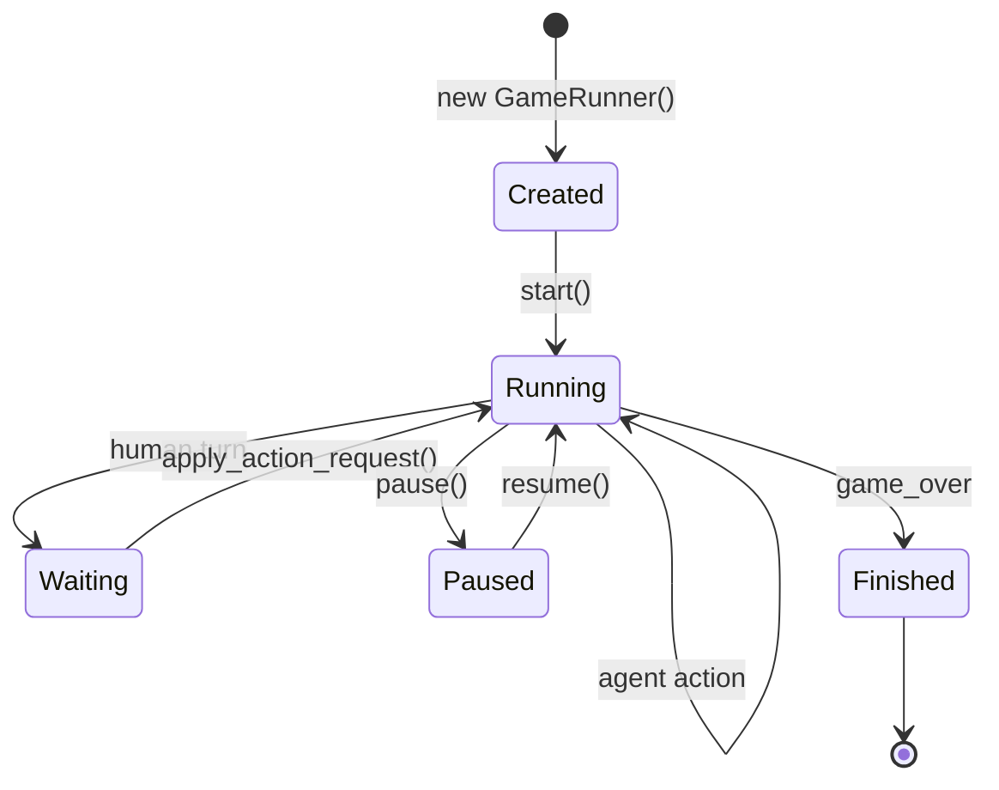

## GameRunner

Async game loop that drives gameplay, manages agents, broadcasts events, and handles human input.

### Lifecycle



### Game Loop

The `_run_loop()` method continuously:

1. Checks for auction phase (rotates through bidders)
2. Gets current player and their role
3. Human players: waits for external action
4. AI agents: calls `agent.choose_action()`
5. Applies action and broadcasts events
6. Sleeps for `tick_ms` before next iteration
7. Persists events to database

### Human Player Interaction

```python
# Client queries legal actions
actions = await runner.get_legal_actions(player_id=0)
# [{"action_type": "ROLL_DICE", "params": {}}, ...]

# Client submits action
accepted, reason = await runner.apply_action_request(
    action_type="ROLL_DICE",
    params={},
    player_id=0
)
```

### WebSocket Subscription

```python
# Subscribe to events
queue = await runner.subscribe()

# Receive events
while True:
    message = await queue.get()
    # {"type": "events", "events": [...]}

# Unsubscribe
await runner.unsubscribe(queue)
```

### Event Broadcasting

```mermaid
sequenceDiagram
  participant Loop as Game Loop
  participant Logger as GameLogger
  participant Clients as WebSocket Clients
  participant DB as Database

  Loop->>Loop: apply_action()
  Loop->>Logger: flush_engine_events()
  Logger->>DB: persist events
  Loop->>Clients: broadcast({"type": "events", ...})
```

### Speed Control

```python
# Change action pacing (0-10000 ms)
await runner.set_tick_ms(200)
```

### Turn Queries

```python
# List all turns with event indices
turns = await runner.list_turns()
# [{"turn_number": 0, "from_index": 0, "to_index": 5}, ...]

# Get events for specific turn
events = await runner.get_turn_events(turn_number=5)
```

### Catch‑up Events

```python
# Get events since index (for reconnecting clients)
data = await runner.get_events_since(since_index=100)
# {"events": [...], "from_index": 100, "to_index": 150}
```

### Reference

::: server.runner.GameRunner
