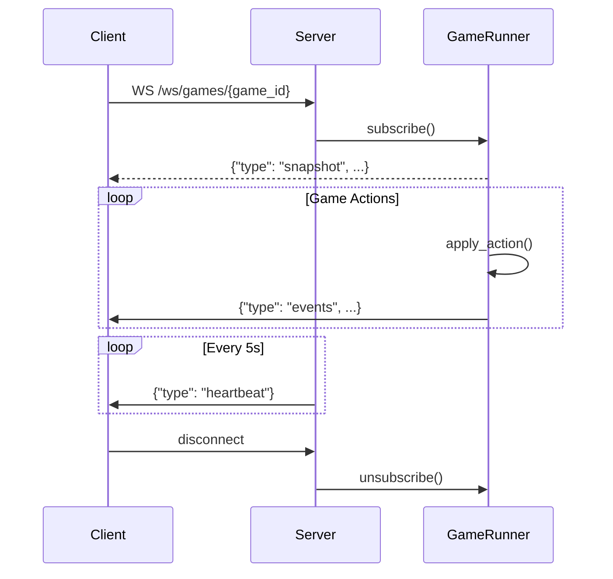

## WebSocket Protocol

Real‑time game events are delivered via WebSocket connection.

### Connection

```python
import asyncio
import websockets
import json

async def watch_game(game_id: str):
    uri = f"ws://localhost:8000/ws/games/{game_id}"
    async with websockets.connect(uri) as ws:
        async for message in ws:
            data = json.loads(message)
            print(data["type"], data)
```

### Message Types

**Snapshot** (initial message on connect)

```json
{
  "type": "snapshot",
  "game_id": "abc123",
  "snapshot": {
    "turn_number": 15,
    "current_player_id": 2,
    "players": [...],
    "property_ownership": {...}
  },
  "last_event_index": 142
}
```

**Events** (game state changes)

```json
{
  "type": "events",
  "game_id": "abc123",
  "events": [
    {"type": "dice_roll", "player_id": 0, "dice": [4, 3]},
    {"type": "player_moved", "player_id": 0, "position": 7}
  ],
  "from_index": 143,
  "to_index": 144
}
```

**Heartbeat** (every 5 seconds)

```json
{
  "type": "heartbeat"
}
```

### Catch‑up Query

Connect with `?since=<index>` to receive events from specific index:

```python
uri = f"ws://localhost:8000/ws/games/{game_id}?since=100"
```

Useful for reconnecting clients to catch up on missed events.

### Event Flow Diagram



### Client Implementation Notes

- Messages are JSON‑encoded
- Slow clients may be dropped if their queue fills
- Heartbeats help detect stale connections
- Use `from_index` / `to_index` to track event sequence
- Reconnect with `?since=last_event_index` to resume

### Event Types

Common event types in the `events` array:

| Type | Description |
|------|-------------|
| `turn_start` | New turn began |
| `dice_roll` | Player rolled dice |
| `player_moved` | Player changed position |
| `property_purchased` | Player bought property |
| `rent_paid` | Rent transferred between players |
| `auction_started` | Auction began for property |
| `auction_bid` | Player placed bid |
| `auction_won` | Auction completed |
| `house_built` | House constructed |
| `player_bankruptcy` | Player eliminated |
| `game_over` | Game finished |
